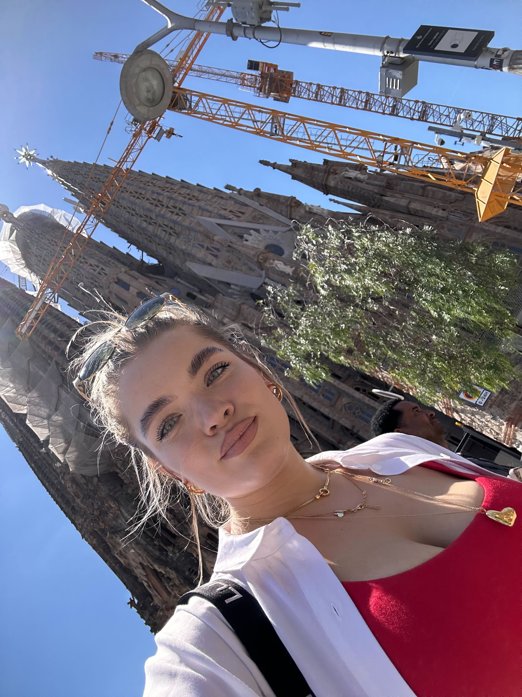
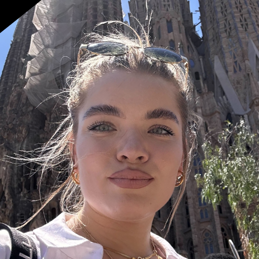

# FaceSwap

This is a simple online face swapping solution, which is based on ACE++

## Description

All results can be found at faceswap/data/faceswaps

Pipeline consist of several main steps:

### 1. Face aligment and mask creation

It's located under faceswap/preprocess/align.py.

Main logic is to detect face and landmarks. And after align face by eyes and lips landmarks.
It utilizes RetinaFace and Landmark106 models from [insight face](https://github.com/deepinsight/insightface).
Also, there are option to use [mediapipe](https://github.com/google-ai-edge/mediapipe) as landmark model, but it produces lower quality of alignment (settings located at faceswap/preprocess/config.py)


Example of steps before and after:

Before:



After:



Before:


After:


Mask creation use landmarks to create mask from it

Before:


After:


### 2. Face swap + enhancement

Second step utilize ACE++ model based on the Flux.1 Fill

Comfy workflow with the same pipeline can be founded in faceswap/inpaint/workflow/Flux_ACE++.json

### Enhancement
To improve naturalness and quality of face,
solution utilize [portrait lora](https://huggingface.co/ali-vilab/ACE_Plus/tree/main/portrait)
and [FLUX.1-Turbo-Alpha LoRa](https://civitai.com/models/876388/flux1-turbo-alpha)

Input:


Output:


Input:


Result:


## Installation

1. Install dependencies
```bash
pip install -e .
```

2. Download checkpoints from https://drive.google.com/drive/folders/1MF_mTWnfui9yOcSk3Vsu44SayQ8kx_zu?usp=sharing

3. Place them in some folder

4. Set path to the folder with checkpoints in environment variable
```bash
export MODELS_DIR=<path_to_checkpoints>
```

## Usage

```bash
export PYTHONPATH=$PYTHONPATH:$(pwd)/faceswap/inpaint
python faceswap --source <source_image> --target <target_image> --output <output_image>
```
